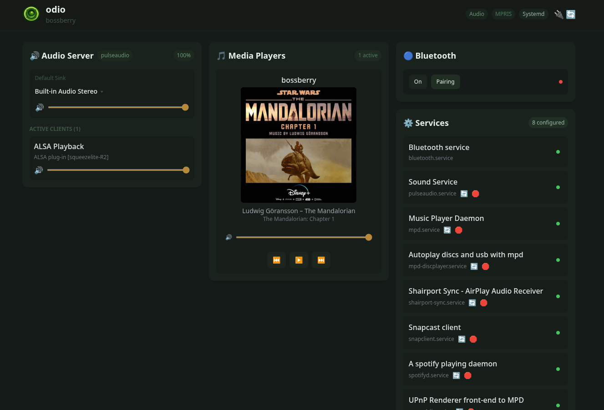

import { Aside } from '@astrojs/starlight/components';

odio doesn't lock you into its built-in sources. You're free to install and run any additional software on your Pi. The path covered here is **PulseAudio** output in a user systemd unit running as the odio user, which integrates cleanly with the odio UI, routing, and volume. Other paths are possible but sit [outside this page's scope](#beyond-pulseaudio).

<Aside type="tip">This page is a work in progress. If you've successfully run other software on odio, please [contribute to the docs](https://github.com/b0bbywan/odio-docs) or [open a discussion](https://github.com/b0bbywan/odios/discussions) to share your setup!</Aside>

## The PulseAudio default

odio manages audio routing and volume through PulseAudio, and the odio UI lists every PulseAudio client with its own volume slider. Third-party software should send audio to PulseAudio so it shows up there and behaves like any other source. See the [Plexamp](#example-plexamp) and [Squeezelite](#example-squeezelite-with-lms) examples below for concrete setups.

## MPRIS integration

odio detects and exposes media sources through [MPRIS](/api/mpris/). For third-party software to appear in the odio UI and Home Assistant, it needs to register as an MPRIS player on the session D-Bus. Whether that works depends on the software itself, some support it natively, others need a plugin or wrapper (like [Kodi](/guides/use-case-htpc/#kodi), [MPD](/guides/mpd/), or [Squeezelite](#example-squeezelite-with-lms)), and some may require specific build flags or configuration.

<Aside type="note">There is no guarantee that a given application will expose an MPRIS interface. This is community territory — if you get it working, please share your setup!</Aside>

## Example: Plexamp

[Plexamp](https://www.plex.tv/plexamp/) can run in headless mode on a Raspberry Pi, turning your odio node into a Plexamp endpoint you can cast to from any Plex client.

<Aside type="caution">This is a theoretical example — it has not been tested on odio. Plexamp uses PulseAudio by default on Linux so it should work in theory, but there may be unexpected issues.</Aside>

**Requirements:**
- A Plex Media Server on your network
- An active Plex Pass subscription

**Installation:**

A community script automates the setup — see [this gist](https://gist.github.com/tgp-2/fc34c5389bc3e4ef332e28d9430b0ebf) for full instructions. The short version:

1. SSH into your odio node.
2. Download and run the installer script with the `--user` flag so Plexamp runs as a user service and can access PulseAudio:
   ```bash
   bash plexamp.sh --user
   ```
3. Enter your Plex claim code and choose a player name.
4. Reboot.

Plexamp will be available at `http://<your-node>:32500`. Use the Cast feature from Plexamp on another device to select your Pi as the playback target.

## Example: Squeezelite with LMS

[Squeezelite](https://github.com/ralph-irving/squeezelite) is a software player for [Logitech Media Server](https://github.com/LMS-Community/slimserver) (LMS). On its own it has no MPRIS interface, but paired with the [mprisqueeze](https://github.com/jecaro/mprisqueeze) wrapper it registers on D-Bus as an MPRIS player and shows up in the odio UI and Home Assistant like any other source, with cover art and transport controls.

<Aside>Setup contributed by [@sm0kingm4n](https://github.com/sm0kingm4n) on [issue #38](https://github.com/b0bbywan/odios/issues/38), tested on a Raspberry Pi against a remote LMS. The instructions below follow the [mprisqueeze README](https://github.com/jecaro/mprisqueeze#readme) for the authoritative invocation.</Aside>

**Requirements:**
- An LMS server on your network (running on the odio node or on a NAS, either works)
- The odio node's user session (same user that runs odio)

**Installation:**

1. Install the PulseAudio build of Squeezelite from Debian:

   ```bash
   sudo apt install squeezelite-pulseaudio
   ```

   The package provides the `/usr/bin/squeezelite-pulseaudio` binary, which outputs to PulseAudio directly.

2. Install `mprisqueeze`. The simplest path is via Cargo (a Rust toolchain is required):

   ```bash
   cargo install mprisqueeze
   ```

   See the [mprisqueeze README](https://github.com/jecaro/mprisqueeze#readme) for alternatives (Nix flake, build from source). The binary lands in `~/.cargo/bin/mprisqueeze`.

3. Create a user systemd unit at `~/.config/systemd/user/mprisqueeze.service`, adapted from the [example in the mprisqueeze README](https://github.com/jecaro/mprisqueeze#readme):

   ```ini
   [Unit]
   Description=mprisqueeze

   [Service]
   ExecStart=%h/.cargo/bin/mprisqueeze -p my-player -H LMSSERVERIP -- squeezelite-pulseaudio -n {name} -s {server}
   Restart=always
   RestartSec=3
   Type=simple

   [Install]
   WantedBy=default.target
   ```

   Replace `my-player` (the name shown in LMS) and `LMSSERVERIP`. Drop `-H LMSSERVERIP` entirely to let mprisqueeze auto-discover the server on the LAN, as documented in the README.

4. Enable and start the service:

   ```bash
   systemctl --user daemon-reload
   systemctl --user enable --now mprisqueeze.service
   ```

Squeezelite registers as an MPRIS player on the user session bus, and the odio UI picks it up automatically.



## Other ideas

Anything that can run on a Pi in user session and output to PulseAudio is fair game. Some possibilities:

- **Jellyfin** — self-hosted media server with [MPV Shim](https://github.com/jellyfin/jellyfin-mpv-shim) for headless audio playback

<Aside type="tip">If you've got another extension running on odio, jump into [the discussions](https://github.com/b0bbywan/odios/discussions) or open a PR on [odio-docs](https://github.com/b0bbywan/odio-docs), tested setups are very welcome.</Aside>

## Beyond PulseAudio

Some users run audio software directly on ALSA for specific needs like high sample rates or bit-perfect paths to a DAC, bypassing the PulseAudio stack odio manages. That's outside the scope of this documentation, odio's routing and volume controls only apply to PulseAudio clients, so a raw-ALSA stream won't be affected by them.

For a concrete example, see [@sm0kingm4n's write-up on issue #38](https://github.com/b0bbywan/odios/issues/38), which uses [squeezelite-R2](https://github.com/marcoc1712/squeezelite-R2) for server-side upsampling up to 768 kHz via LMS's C-3PO plugin.

<Aside type="tip">Want a proper ALSA guide here? Contributions are welcome as PRs on [odio-docs](https://github.com/b0bbywan/odio-docs), with one ask: walk through the setup in enough detail that the maintainer can understand and validate it before merging, not just a list of commands.</Aside>
