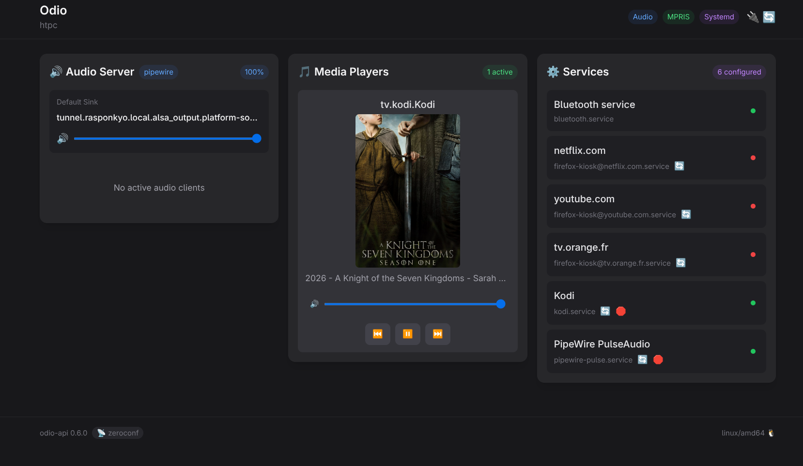

An HTPC running [Kodi](https://kodi.tv/) or a browser for streaming already handles video and media playback. odio fits right alongside it, you get a DAC-quality audio output for both movies and music, with unified control over every source.

## Audio through the DAC

Set `PULSE_SERVER` to the IP of your odio node, and all HTPC audio routes to the node's DAC via [PulseAudio TCP](/guides/network-audio/). This applies to everything running on the HTPC: Kodi, Firefox, Chrome, any application.

### Kodi

Run Kodi as a systemd user service with PulseAudio as audio backend:

```ini
[Unit]
Description=Kodi
After=graphical-session.target

[Service]
Type=simple
Environment=WAYLAND_DISPLAY=wayland-1
Environment=XDG_RUNTIME_DIR=/run/user/%U
Environment=PULSE_SERVER=192.168.x.x:4713
ExecStart=/usr/bin/kodi --standalone --audio-backend=pulseaudio
ExecStop=/usr/bin/killall kodi.bin
Restart=no
TimeoutStopSec=20

[Install]
WantedBy=default.target
```

### Firefox / Chrome kiosk

For Firefox or Chrome kiosk (Netflix, YouTube, streaming services), use a templated systemd user service:

```ini
[Unit]
Description=%i
After=graphical-session.target

[Service]
Type=simple
Environment=WAYLAND_DISPLAY=wayland-1
Environment=XDG_RUNTIME_DIR=/run/user/%U
ExecStart=/usr/bin/firefox -P %i --no-remote --new-window --kiosk https://%i
ExecStop=/bin/kill $MAINPID
Restart=no
KillMode=mixed
TimeoutStopSec=5

[Install]
WantedBy=default.target
```

Enable with the service name matching the URL, e.g. `systemctl --user start firefox-kiosk@netflix.com`.

### Plex

[Plex](https://www.plex.tv/) users can stream directly to an odio node via AirPlay, no extra setup beyond Plex's native AirPlay support. Confirmed by /u/Sterkenzz.

## Unified control with go-odio-api

Install [go-odio-api](/api/overview/) on the HTPC and it discovers every MPRIS player running in the session. Kodi requires the [MPRIS D-Bus interface](https://kodi.wiki/view/Add-on:MPRIS_D-Bus_interface) addon to be discovered.

With the [systemd backend](/api/systemd/) configured, you can start and stop Kodi, Firefox kiosk, or any other whitelisted service directly from the [embedded web UI](/guides/embedded-ui/), the [odio application](/guides/pwa/), or [Home Assistant](/guides/home-assistant/).



## Remote control

Control the HTPC from anywhere:

- The [odio application](/guides/pwa/) from your phone
- [Home Assistant](/guides/home-assistant/) with auto-discovery
- A [UPnP control point](/guides/dlna/) like BubbleDS Next or BubbleUPnP to browse a DLNA server and direct playback to the HTPC
