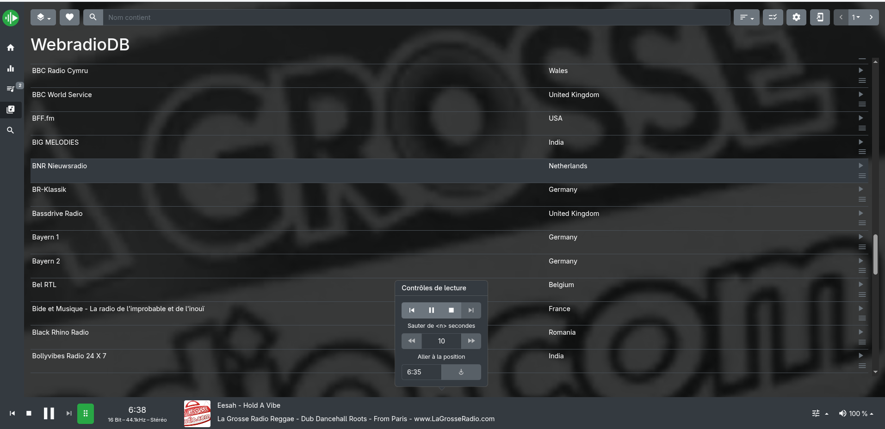
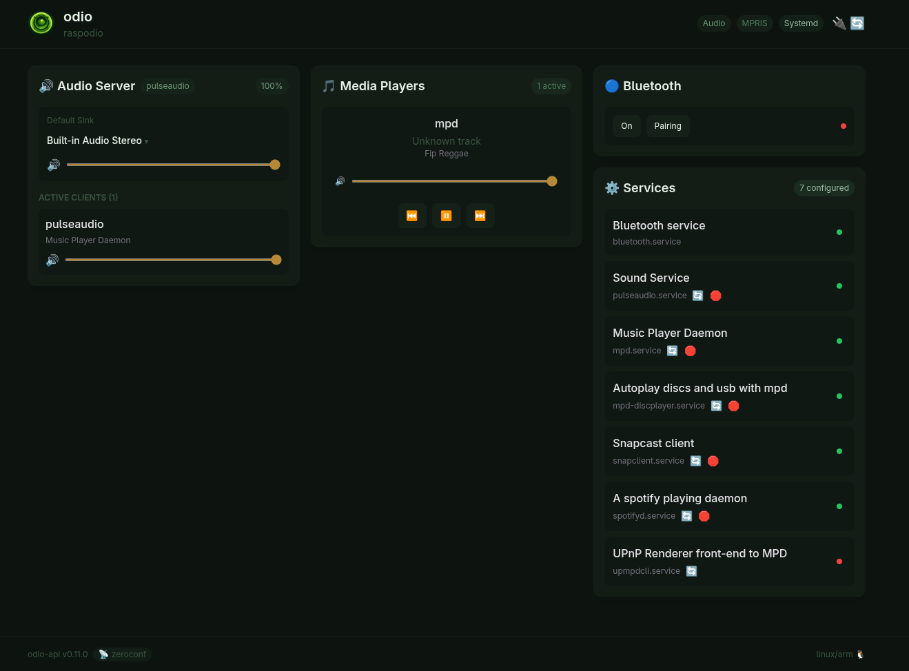

import { Aside } from '@astrojs/starlight/components';
import { Image } from 'astro:assets';
import library from '../../../assets/webradios-library.png';
import radioBrowser from '../../../assets/webradios-radio-browser.png';
import countries from '../../../assets/webradios-countries.png';
import france from '../../../assets/webradios-france.png';
import tags from '../../../assets/webradios-tags.png';
import stations from '../../../assets/webradios-stations.png';
import playing from '../../../assets/webradios-playing.png';

Webradios are now integrated directly on odio, a first version that sits alongside your music library. The [upmpdcli](https://www.lesbonscomptes.com/upmpdcli/) backend exposes a set of built-in station sources in the [UPnP/DLNA](/guides/dlna/) library, browsable from any control point. A more polished experience (in-UI favorites, station picker) will come later.

<Aside>Available since odio [2026.4.1rc1](https://github.com/b0bbywan/odios/releases/tag/2026.4.1rc1). Huge thanks to [@pbattino](https://github.com/pbattino), first external contributor on odio, whose exploratory work on web radios made it possible to ship this first iteration ahead of the original roadmap.</Aside>

<div class="screenshot-carousel">
	<figure>
		<Image src={library} alt="upmpdcli library root with Mother Earth Radio, Qobuz, Radio Browser, Radio Paradise, and Upmpdcli Radio List" />
		<figcaption>Library root, webradio sources next to Qobuz and virtual folders</figcaption>
	</figure>
	<figure>
		<Image src={radioBrowser} alt="Radio Browser entry with countries, languages, and tags folders" />
		<figcaption>Radio Browser, navigable by country, language, or tag</figcaption>
	</figure>
	<figure>
		<Image src={countries} alt="Countries list including Brazil, Canada, Chile, Finland, France, Germany, Greece, Honduras, Indonesia" />
		<figcaption>Countries, drill into the global catalog</figcaption>
	</figure>
	<figure>
		<Image src={france} alt="France folder with languages, tags, and 1000 radios subfolders" />
		<figcaption>Inside a country, subcategories and a top-stations shortcut</figcaption>
	</figure>
	<figure>
		<Image src={tags} alt="Tags list: rock, dance, electro, funk, pop rock, house, hits, soul, oldies, news, reggae, world music, disco, crooner, alternative, 80s" />
		<figcaption>Tags, browse by genre</figcaption>
	</figure>
	<figure>
		<Image src={stations} alt="35 reggae radios: Fly Foot Selecta, Generations Reggae, I have a dream, King Dub Radio, La Grosse Radio Reggae, Latina Reggaeton, Le Bon Mix" />
		<figcaption>Station list with artwork, ready to play</figcaption>
	</figure>
	<figure>
		<Image src={playing} alt="Now playing La Grosse Radio Reggae on odio, MP3 at 192 kbps, 44.1 kHz, with cover art and transport controls" />
		<figcaption>Playback on the odio node, controllable from the same app</figcaption>
	</figure>
</div>

## Built-in sources

Browsing an odio node from any UPnP/DLNA control point ([BubbleDS Next](/guides/dlna/), BubbleUPnP, Home Assistant's media browser) exposes these radio sources as top-level folders in the library:

- **Radio Browser**, the [radio-browser.info](https://www.radio-browser.info/) community catalog, navigable by country, language, or tag.
- **[Radio Paradise](https://radioparadise.com/home)**, direct access to Radio Paradise's streams.
- **[Mother Earth Radio](https://motherearthradio.de/en/)**, high-quality streams from Mother Earth Radio.
- **Upmpdcli Radio List**, a server-side curated station list configured in upmpdcli.

Pick a station, it plays through the odio node like any other source. Playback is visible in the odio API as an MPD session, controllable from the [embedded UI](/guides/embedded-ui/), the [odio application](/guides/pwa/), or [Home Assistant](/guides/home-assistant/).


## Via Home Assistant's Radio Browser

If you'd rather stay inside Home Assistant, [its Radio Browser integration](https://www.home-assistant.io/integrations/radio_browser/) is backed by the same [radio-browser.info](https://www.radio-browser.info/) database. It adds a station catalog to the HA media browser that can be played to any odio node exposed as an [AirPlay](/guides/airplay/), [DLNA/UPnP](/guides/dlna/), or [MPD](/guides/mpd/) media player entity.

Discovery and browsing live in HA, playback lands on odio as any other network speaker.


## Via a remote MPD

MPD plays HTTP streams natively, so any station URL can be queued directly:

```bash
mpc add http://example.stream/radio.mp3
mpc play
```

Any MPD client (M.A.L.P., myMPD, ncmpcpp) can store stations as playlists or favorites. The [remote MPD setup in the MPD guide](/guides/mpd/#using-a-remote-mpd-on-your-nas) also applies here, if you already run MPD on a NAS with its library and station list and output audio to the odio node over PulseAudio TCP, your station favorites sit alongside the rest of your library.

If you already run a [myMPD](https://jcorporation.github.io/myMPD/) instance somewhere on your network pointed at the MPD on the odio node, the webradio experience is much better than the raw-playlist approach below, myMPD integrates [webradiodb](https://jcorporation.github.io/webradiodb/) natively for browsing, searching, and adding stations to favorites, with playback handled by the odio node's MPD.



If mympd is installed along odio-api, the stream just shows up as the active MPD media player in the embedded UI, same as any other MPD playback, with transport controls and the current stream title.



<details>
<summary>Example: drop an M3U station list in MPD's playlist folder</summary>

Take any M3U file of station URLs and drop it in MPD's playlist directory, either on the odio node itself or on the NAS running MPD. The playlist then shows up in any MPD client next to your regular playlists.

Format is plain M3U, one `#EXTINF` line per station followed by the stream URL:

```ini
#EXTM3U
#EXTINF:0,FIP
http://icecast.radiofrance.fr/fip-hifi.aac
#EXTINF:0,FIP Jazz
http://direct.fipradio.fr/live/fip-webradio2.mp3
#EXTINF:0,TSF Jazz
http://tsfjazz.ice.infomaniak.ch:80/tsfjazz-high
#EXTINF:0,Radio Nova
http://radionova.ice.infomaniak.ch/radionova-256.aac
#EXTINF:0,Couleur 3
http://stream.srg-ssr.ch/m/couleur3/mp3_128
```

Drop it as e.g. `~/.mpd/playlists/webradios-fr.m3u` (or wherever your `playlist_directory` points), run `mpc lsplaylists` to confirm MPD picked it up, then load and play it from any client.

</details>

<Aside type="note">The built-in sources cover most needs, but favorites, custom editing, and an in-UI station picker are still being scoped on [discussion #33](https://github.com/b0bbywan/odios/discussions/33), where [@pbattino](https://github.com/pbattino) has been particularly helpful shaping the direction. Feedback and contributions welcome.</Aside>
